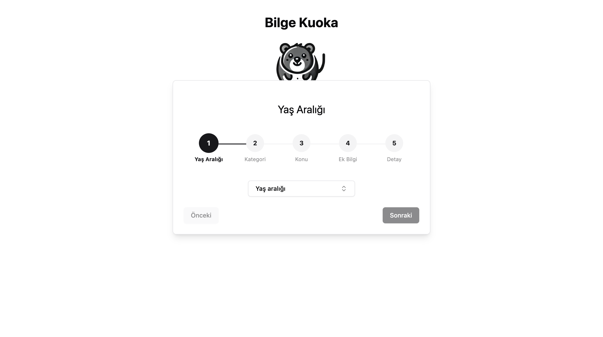

# Bilge-Kuoka: Yapay Zeka Destekli Bilgi Platformu

## Canlı Demo

Platformumuzu denemek için aşağıdaki bağlantıya tıklayabilirsiniz:

👉 **[Bilge-Kuoka Platformuna Git](http://45.147.46.138/start)**

## Proje Hakkında

**Bilge-Kuoka**, BTK Hackathon için geliştirilmiş, Gemini API ile üretken yapay zeka kullanarak bilgi sunan interaktif bir platformdur. Bu platform, kullanıcılara ilgi alanlarına göre detaylandırılmış ve kişiselleştirilmiş bilgi edinme deneyimi sunar. Bilge-Kuoka ile kullanıcılar istedikleri konuda özelleştirilmiş içeriklere kolayca erişebilirler.

## Özellikler

### 1. **Kategori ve Alt Kategori Seçimi**
   - Kullanıcılar ilgi duydukları bir kategori seçerler. Bu kategoriler, yapay zeka tarafından dinamik olarak oluşturulmaktadır ve kullanıcıya en alakalı seçenekleri sunar.
   - Kategori seçiminden sonra yapay zeka tarafından üretilen alt kategorilerle içerik daha spesifik hale gelir. Böylece kullanıcılar, aradıkları konuda derinlemesine bilgiye erişebilirler.

### 2. **Yaş ve Detay Seviyesi Ayarları**
   - Bilge-Kuoka, kullanıcının yaşına uygun içerik sunarak her yaş grubuna hitap etmeyi amaçlar. Yaş seçimi, içeriklerin anlaşılabilirliğini artırır.
   - Kullanıcılar ayrıca içeriklerin detay seviyesini belirleyebilir. Örneğin, makalenin çok uzun olmaması istenirse, yapay zeka bu tercihi dikkate alarak daha kısa ve özet içerikler sunar.

### 3. **Ek Bilgi Girişi**
   - Kullanıcılar, içerik hakkında ek bilgi girerek aradıkları içeriği daha fazla özelleştirebilirler. Bu özellik, yapay zekanın daha hedefli ve ilgili içerikler üretmesine olanak tanır.

### 4. **Yapay Zeka Destekli Tavsiyeler**
   - Makale açıldığında, Gemini API ile çalışan yapay zeka, kullanıcıya benzer ve alakalı diğer makaleleri tavsiye eder. Bu özellik, kullanıcıların ilgi duydukları konuda farklı kaynaklara kolayca ulaşmasını sağlar.
   - Tavsiye edilen makaleler, kullanıcıya yeni bilgi alanlarını keşfetme fırsatı sunar.

### 5. **Makale Geçmişi**
   - Bilge-Kuoka, kullanıcının daha önce açtığı makaleleri sol tarafta bir geçmiş olarak gösterir. Tıpkı ChatGPT geçmişi gibi, kullanıcılar istedikleri zaman daha önce okudukları makalelere dönebilirler.
   - Bu geçmiş özelliği, kullanıcıların bilgi yolculuklarını organize etmelerine ve önceki içeriklere kolayca erişmelerine yardımcı olur.

## Projenin Amacı

Bilge-Kuoka'nın amacı, yapay zeka destekli bir bilgi edinme süreci sunarak kullanıcıların ilgi alanlarına uygun bilgilere hızlı ve verimli bir şekilde erişim sağlamaktır. Platform, kullanıcıların seçtikleri konularda derinlemesine bilgiye ulaşmalarına, yaş ve detay tercihlerine göre özelleştirilmiş içerik elde etmelerine olanak tanır. Ayrıca, geçmiş makale listesi ve yapay zeka destekli tavsiyeler ile bilgi yolculuğunu zenginleştirir.

## Hedef Kullanıcı Kitlesi

Bilge-Kuoka, bilgiye hızlı ve etkili bir şekilde ulaşmak isteyen tüm kullanıcı kitlesine hitap eder. Özellikle öğrenciler, araştırmacılar ve bilgiye meraklı herkes, bu platform ile kapsamlı ve kişiselleştirilmiş bilgiye erişebilir.

---

## Sunum Videosu

Projemizi tanıtan kısa bir video sunumuna buradan ulaşabilirsiniz:

Bu video, platformun işleyişini ve kullanıcı deneyimini daha iyi anlamanızı sağlayacaktır.

## Ekran Görüntüleri

Platformun çeşitli özelliklerini gösteren ekran görüntüleri aşağıda sunulmuştur:

### Ana Sayfa

### Kategori Seçimi

### Makale Görünümü

BTK Hackathon’u için sunduğumuz **Bilge-Kuoka** projesinde, kullanıcı odaklı ve yapay zeka destekli bir bilgi edinme deneyimi sunmaktan büyük mutluluk duyuyoruz. Amacımız, kullanıcıların ilgilendikleri konulara kolayca erişmelerini sağlayarak, verimli bir öğrenme ortamı oluşturmaktır!
